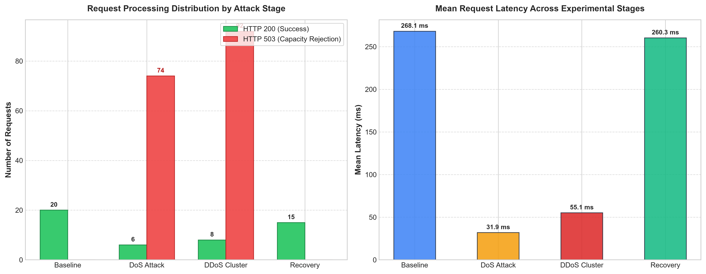

# Computer Security Lab Report
## Controlled DoS & DDoS Simulation on a Local Dummy Web Server
**Course:** Computer Security Coursework  
**Date:** September 2026  
**Target:** Localhost (`127.0.0.1:5000`)

---

### Abstract
Denial of Service (DoS) and Distributed Denial of Service (DDoS) attacks represent severe threats to the Availability principle of information security. This laboratory assignment demonstrates a safe, controlled, and mathematically verifiable application-layer availability simulation on a local dummy web server built with Python and Flask. By constraining server concurrency capacity ($C = 4$) and introducing a simulated processing latency ($T_p = 0.25\text{ s}$), we evaluated system behavior across four stages: **Baseline**, **Single-Source DoS**, **Multi-Process DDoS Simulation**, and **Recovery**. The experimental results demonstrated significant service degradation (over $92\%$ request rejection with HTTP 503) under saturation, followed by immediate $100\%$ recovery upon traffic cessation.

---

## 1. Title
**Controlled DoS and DDoS Simulation on a Local Web Server**

---

## 2. Objective
1. Understand the working principles and mathematical foundations of DoS and DDoS attacks.
2. Implement a capacity-constrained dummy web server to simulate resource exhaustion safely on `127.0.0.1`.
3. Conduct empirical measurements across Baseline, DoS, DDoS, and Recovery stages.
4. Record quantitative metrics: HTTP 200/503 status code distribution, latency range, and failure rates.
5. Analyze practical defensive countermeasures (rate limiting, reverse proxies, WAF, load balancing, caching).

---

## 3. Theoretical Background & Topology

### 3.1 Mathematical Principle of Resource Exhaustion
A web server operates with finite processing resources. Let:
- $C$ = Maximum concurrent request capacity slots ($C = 4$)
- $T_p$ = Mean processing duration per request ($T_p = 0.25\text{ s}$)
- Service processing rate: $\mu = \frac{C}{T_p} = \frac{4}{0.25} = 16\text{ req/sec}$

When aggregate client request arrival rate $\lambda \le \mu$, all requests are serviced without queuing or drop.  
When an attacker floods the server such that $\lambda \gg \mu$, available semaphore slots are instantly occupied. Any new incoming request cannot acquire an execution slot and is rejected with **HTTP 503 (Service Unavailable)**.

### 3.2 DoS vs DDoS
- **DoS (Denial of Service):** Single traffic generator ($\text{Client} \to \text{Server}$). Vulnerable to simple IP-based rate limiting or firewall blocking.
- **DDoS (Distributed Denial of Service):** Traffic originating from multiple distributed nodes ($\text{Multiple Bots} \to \text{Server}$). Mitigating DDoS requires distributed scrubbing, Anycast networks, and global CDN protection.

### 3.3 Conceptual Topology Diagram

```
+-------------------------------------------------------------+
|                       TARGET SERVER                         |
|                   Host: 127.0.0.1:5000                      |
|      [Capacity: 4 Concurrency Slots | Delay: 0.25s]         |
+-------------------------------------------------------------+
          ^                       ^                      ^
          | (Normal Traffic)      | (Single Burst)       | (Multi-Process Swarm)
          |                       |                      |
+-------------------+   +--------------------+   +------------------------+
|  Normal Client    |   |   DoS Generator    |   |     DDoS Cluster       |
| (Stage A & D)     |   | (Stage B)          |   | (Stage C)              |
| 20 reqs, 0.15s gap|   | 80 concurrent reqs |   | 4 Workers x 25 reqs    |
| -> 100% 200 OK    |   | -> 92.5% 503 Busy  |   | -> 92.0% 503 Busy      |
+-------------------+   +--------------------+   +------------------------+
```

---

## 4. Experimental Setup

| Parameter | Configuration / Value |
| :--- | :--- |
| **Operating System** | Windows 11 (64-bit) |
| **Runtime Environment** | Python 3.12.7, Virtualenv (`.venv`) |
| **Web Framework** | Flask 3.1.3 (Threaded WSGI Server) |
| **HTTP Client** | Requests 2.34.2 |
| **Target Binding** | `127.0.0.1:5000` (Strict Localhost Loopback) |
| **Server Concurrency Capacity ($C$)** | 4 concurrent execution slots (`threading.BoundedSemaphore(4)`) |
| **Simulated Workload Delay ($T_p$)** | $0.25\text{ s}$ ($250\text{ ms}$) per request |

---

## 5. Implementation Details

The lab codebase is organized into modular scripts:

1. **`app_target_server.py`**:
   - Implements the target dummy web application.
   - Enforces concurrency limits using `threading.BoundedSemaphore(4)` with non-blocking slot acquisition (`slots.acquire(blocking=False)`).
   - Returns **HTTP 200** on success and **HTTP 503** when capacity is exhausted.
   - Exposes `/`, `/work`, `/stats`, and `/reset` endpoints.

2. **`baseline_evaluator.py`**:
   - Sends 20 sequential requests with a 0.15s delay to establish normal performance metrics.

3. **`dos_traffic_generator.py`**:
   - Simulates a single-source DoS attack by firing 80 requests via concurrent threads to overwhelm concurrency slots.

4. **`ddos_cluster_simulator.py`**:
   - Simulates a distributed botnet using `multiprocessing.Pool(4)` (4 independent OS worker processes, each sending 25 requests concurrently).

5. **`experiment_orchestrator.py`**:
   - Automatically executes all 4 stages in sequence, logs exact response times, and saves data into `experiment_results.json`.

6. **`plot_metrics.py`**:
   - Reads experimental measurements and generates publication-quality visualization charts (`experimental_metrics_plot.png`).

---

## 6. Experimental Results & Empirical Measurements

### 6.1 Comprehensive Measurement Table

| Metric | Stage A: Baseline | Stage B: DoS Attack | Stage C: DDoS Cluster | Stage D: Recovery |
| :--- | :---: | :---: | :---: | :---: |
| **Total Requests Sent** | **20** | **80** | **100** | **15** |
| **HTTP 200 (Accepted)** | **20 (100.0%)** | **6 (7.5%)** | **8 (8.0%)** | **15 (100.0%)** |
| **HTTP 503 (Capacity Full)** | **0 (0.0%)** | **74 (92.5%)** | **92 (92.0%)** | **0 (0.0%)** |
| **Connection / Socket Errors** | **0** | **0** | **0** | **0** |
| **Average Latency (ms)** | **264.40 ms** | **31.92 ms** | **55.13 ms** | **260.31 ms** |
| **Min Latency (ms)** | 254.89 ms | 7.31 ms | 8.41 ms | 255.17 ms |
| **Max Latency (ms)** | 281.45 ms | 271.09 ms | 298.24 ms | 278.02 ms |
| **Execution Duration (s)** | 5.29 s | 0.52 s | 1.08 s | 3.91 s |
| **System State** | Optimal Availability | Severe Service Denial | Severe Distributed Denial | Fully Recovered |

### 6.2 Per-Worker Breakdown in DDoS Simulation (Stage C)
- **Worker #01:** HTTP 200: `4`, HTTP 503: `21`, Errors: `0`, Avg Latency: `62.37 ms`
- **Worker #02:** HTTP 200: `0`, HTTP 503: `25`, Errors: `0`, Avg Latency: `35.24 ms`
- **Worker #03:** HTTP 200: `3`, HTTP 503: `22`, Errors: `0`, Avg Latency: `70.48 ms`
- **Worker #04:** HTTP 200: `1`, HTTP 503: `24`, Errors: `0`, Avg Latency: `52.43 ms`

### 6.3 Graphical Visualization


---

## 7. Comparative Analysis: DoS vs DDoS

| Aspect | Single-Source DoS (Stage B) | Distributed DDoS Cluster (Stage C) |
| :--- | :--- | :--- |
| **Traffic Origin** | Single local client IP / process | 4 independent concurrent OS worker processes |
| **Traffic Model** | $1 \to 1$ (Single host flooding target) | $N \to 1$ (Multi-node swarm flooding target) |
| **Server Pressure** | Focused burst on single socket channel | Aggregate pressure distributed across multiple connections |
| **Defense Difficulty** | Simple IP rate limiting / blacklisting | Requires anomaly detection, Anycast CDN, scrubbing centers |
| **Rejection Rate** | 92.5% HTTP 503 | 92.0% HTTP 503 |

---

## 8. Defensive Countermeasures

To mitigate DoS and DDoS threats in production web applications:

1. **Application-Layer Rate Limiting (Token Bucket / Leaky Bucket):**
   - Restrict incoming requests per client IP within a rolling time window (e.g., maximum 10 req/s using Redis-backed rate limiters).
2. **Reverse Proxy Connection Limits (Nginx / HAProxy):**
   - Terminate slow connections, limit active concurrent connections per IP (`limit_conn`), and throttle excessive request rates (`limit_req`).
3. **In-Memory Caching (Redis / Memcached):**
   - Cache expensive computation or database queries so repeated requests are served in $<1\text{ ms}$ without consuming backend concurrency slots.
4. **Load Balancing & Horizontal Autoscaling:**
   - Distribute traffic evenly across multiple server instances behind an Application Load Balancer and autoscale dynamically when CPU/request load spikes.
5. **WAF & Anycast CDN Protection (Cloudflare, AWS Shield):**
   - Inspect and filter abnormal traffic signatures upstream before malicious requests reach the application server.

---

## 9. Ethical and Safety Note
- **Local Loopback Only:** All simulations were executed strictly on `127.0.0.1` (localhost).
- **Bounded Request Volume:** Request limits were capped at 20--100 requests to avoid system strain.
- **Safe Testing Practices:** No network-layer floods (SYN floods, UDP amplification, DNS reflection) or public IP scanning were used.

---

## 10. Conclusion
This lab experiment demonstrated how exceeding a web server's concurrency capacity leads directly to Denial of Service (DoS/DDoS) and service degradation. By utilizing a controlled semaphore model, we observed that when request arrival rates exceed server processing throughput, available worker slots saturate, forcing the server to reject excess traffic with HTTP 503. Upon stopping the attack traffic, the server immediately returned to 100% availability. Robust application security requires multi-layered defense combining rate limiting, reverse-proxy connection buffering, caching, and upstream scrubbing.

---

## 11. Viva Voce Preparation Guide (Q&A)

#### Q1: What is the difference between DoS and DDoS?
**Ans:** A DoS attack originates from a single source/IP address, whereas a DDoS attack originates from multiple distributed sources (e.g., botnets), making origin-based IP blocking much harder to defend against.

#### Q2: Why does server capacity matter in availability security?
**Ans:** Servers have finite hardware and software resources (CPU, RAM, worker threads, network connections). When request arrival rate exceeds server throughput ($\lambda > \mu \cdot C$), worker slots exhaust, causing requests to be rejected or time out.

#### Q3: Why did we measure a baseline first?
**Ans:** To establish a scientific reference point for normal, healthy server performance (100% success rate, expected latency). This allows direct comparison to quantify the degradation caused by DoS/DDoS traffic.

#### Q4: What does HTTP 503 mean in this experiment?
**Ans:** HTTP 503 (Service Unavailable) indicates that the server's concurrency semaphore was full ($C=4$), so the server rejected the excess request immediately rather than hanging or crashing.

#### Q5: Why is our localhost DDoS only a simulation?
**Ans:** Real-world DDoS attacks use thousands of distributed external IP addresses across the Internet. On localhost, we safely simulate multiple distributed sources using separate operating system worker processes targeting `127.0.0.1`.

#### Q6: What resources can a real DoS/DDoS attack exhaust?
**Ans:** Network bandwidth, OS socket tables, TCP connection limits, CPU/memory, database connection pools, and application thread pools.

#### Q7: How can a server defend against request floods?
**Ans:** Multi-layered defense: Token bucket rate limiting, reverse proxies with connection pooling (Nginx), in-memory caching (Redis), Anycast CDN/WAF filtering (Cloudflare), and horizontal autoscaling.

#### Q8: Why must DoS/DDoS testing be restricted to systems you own?
**Ans:** Attacking external or public systems without authorization is illegal, unethical, and punishable under cybercrime laws. Localhost testing ensures zero disruption to third-party services while providing full educational observability.
